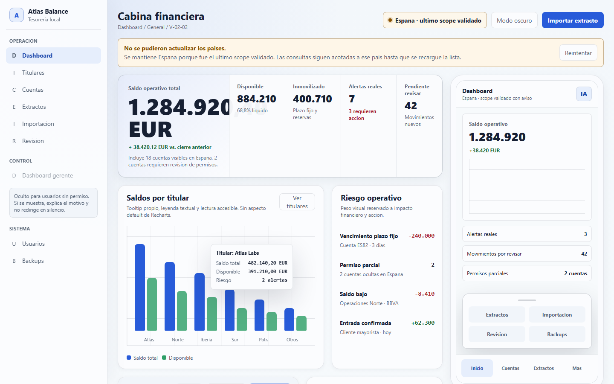
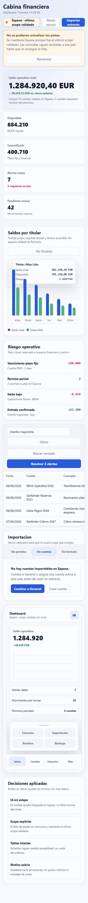
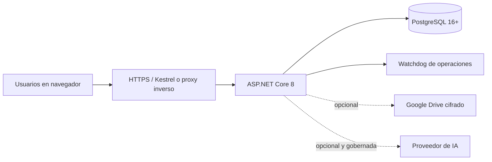

# Atlas Balance



**Tesorería multi-banco, multi-titular y multi-divisa para equipos que necesitan control real sobre sus datos.**

Atlas Balance es una aplicación web **on-premise** para centralizar saldos, movimientos, previsiones y controles operativos en una instalación propia, accesible desde el navegador en la red local de la empresa.

[Documentación de usuario](Documentacion/DOCUMENTACION_USUARIO.md) · [Documentación técnica](Documentacion/DOCUMENTACION_TECNICA.md) · [Guía de release](Atlas%20Balance/README_RELEASE.md) · [Seguridad](SECURITY.md)

> Las imágenes de esta portada son capturas reconstruidas desde el mockup HTML codificado del proyecto, con los mismos tokens y decisiones responsive de Atlas Balance. Usan datos sintéticos; no contienen información real.

## Qué resuelve

- Unifica cuentas bancarias, cajas, titulares y países en un único espacio operativo.
- Permite consultar saldos consolidados y evolución por periodo y divisa.
- Reduce el trabajo manual de importar extractos y revisar movimientos.
- Mantiene permisos, auditoría, alertas, copias y exportaciones dentro del perímetro de la empresa.
- Da una base segura para automatizaciones e integraciones sin convertir la tesorería en un SaaS público.

## Funcionalidad actual

| Área | Qué incluye |
| --- | --- |
| **Visibilidad financiera** | Dashboard global y por titular, evolución de saldo, ingresos, egresos, disponible, inmovilizado, concentración y saldos por país/divisa. |
| **Cuentas y titulares** | Cuentas bancarias y efectivo, titulares de tipo empresa/autónomo/particular, países y divisa base. |
| **Extractos operativos** | Pegado desde Excel/CSV, formatos por banco, columnas extra, filtros, ordenación, paginación y tabla tipo hoja de cálculo. |
| **Edición controlada** | Edición de celdas, inserción de líneas, flags, historial, desglose de recibos y control de conflictos concurrentes. |
| **Importación por lotes** | Validación paginada, advertencias, hash SHA-256, evidencia del lote y reversión lógica. |
| **Conciliación** | Sugerencias por cuenta, fecha e importe, confirmación, excepciones y estados de seguimiento. |
| **Alertas y previsión** | Alertas de saldo bajo, vencimientos de plazo fijo y notificaciones dentro de la aplicación y por email. |
| **Backups y exportaciones** | Copias locales programadas, exportaciones XLSX, retención, restauración y subida cifrada a Google Drive. |
| **Seguridad** | MFA con Authenticator, cookies httpOnly, CSRF, rate limiting, permisos en backend, Row Level Security y auditoría firmada. |
| **IA e integraciones** | IA opcional con OpenRouter, OpenAI o MiniMax, límites y presupuesto; OpenClaw mediante tokens con scopes y acceso financiero de solo lectura. |
| **Operación del sistema** | Actualización desde la interfaz con verificación de digest/firma, backup previo, rollback y health check. |

## Así se ve

La vista desktop concentra el saldo operativo, riesgo, titulares, movimientos e importación en una sola superficie. La vista móvil apila las mismas prioridades y mantiene la navegación inferior.

<p>
  
</p>

## Arquitectura



- **Backend:** ASP.NET Core 8, Entity Framework Core 8, Hangfire y Serilog.
- **Frontend:** React 19, TypeScript, Vite, Zustand, TanStack Query y CSS variables propias.
- **Base de datos:** PostgreSQL 16 o superior, con migraciones y aislamiento RLS para tablas sensibles.
- **Despliegue:** Windows Server como servicio, HTTPS y acceso local o mediante proxy inverso/VPN.

## Seguridad y límites honestos

Atlas Balance está diseñado para una instalación controlada dentro de la red de una empresa. No pretende ser una plataforma multi-tenant pública ni sustituye la configuración segura del servidor.

Antes de usarlo con datos reales hay que verificar HTTPS, BitLocker, ACL de `config`, `backups` y `exports`, certificado/proxy, el ZIP final y un ciclo real de copia y restauración. Las copias locales dependen de la protección del servidor; la copia que se sube a Google Drive se cifra antes de salir.

La IA está desactivada por defecto y queda sujeta a permisos, límites de uso, presupuesto, seudonimización y política de no retención del proveedor cuando aplica. OpenClaw es de solo lectura en el estado actual.

## Desarrollo local

Requisitos: .NET 8 SDK, Node.js compatible con `.node-version`, Docker Desktop y PostgreSQL de desarrollo mediante Docker.

```powershell
Set-Location '.\Atlas Balance'
docker compose up -d

Set-Location '.\frontend'
npm.cmd install
npm.cmd run lint
npm.cmd run test:unit
npm.cmd run build
```

Para el backend, usa las plantillas `appsettings.*.json.template` y configura los secretos únicamente en archivos locales no versionados. La guía completa está en [Documentacion/DOCUMENTACION_USUARIO.md](Documentacion/DOCUMENTACION_USUARIO.md) y [Atlas Balance/README_RELEASE.md](Atlas%20Balance/README_RELEASE.md).

## Estado del proyecto

La línea de trabajo actual es **V-02.07**. El repositorio contiene el producto y su documentación de operación; una release publicable requiere además completar las comprobaciones de infraestructura indicadas en la documentación de versión.

## Licencia

Consulta [LICENSE](LICENSE).
